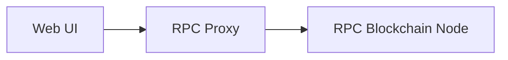
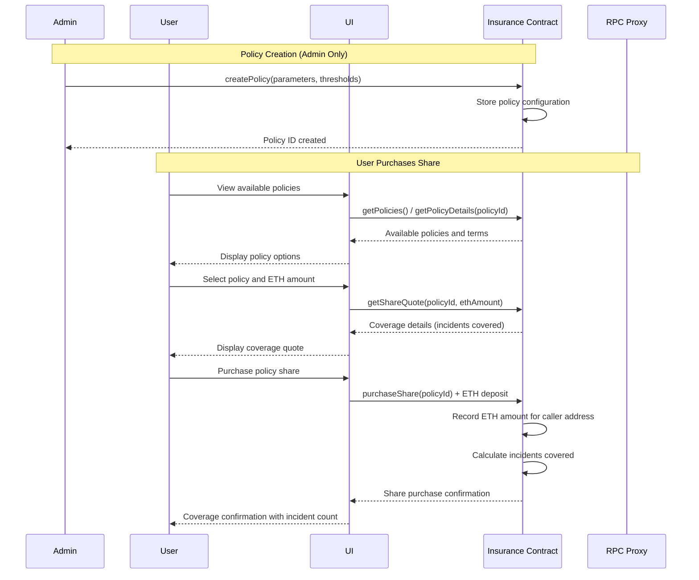
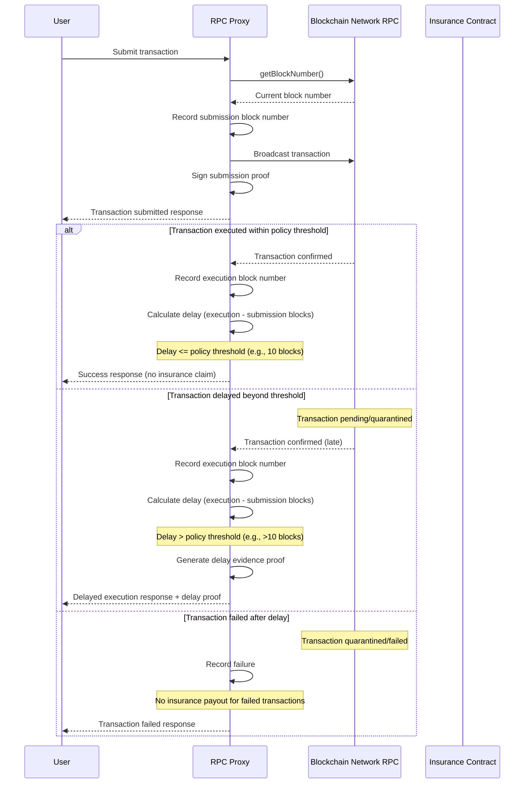
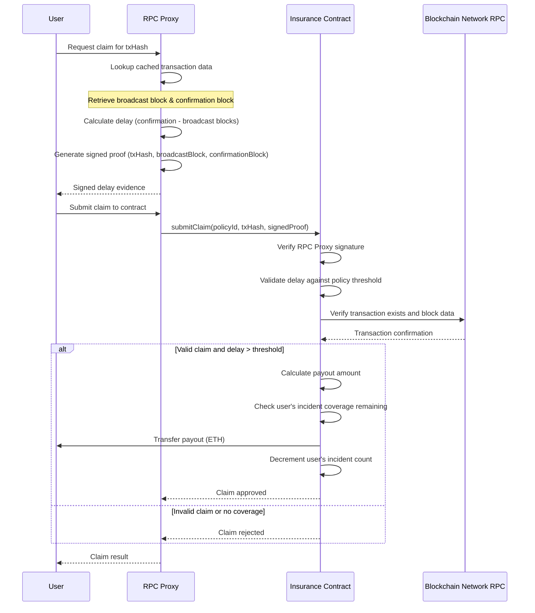
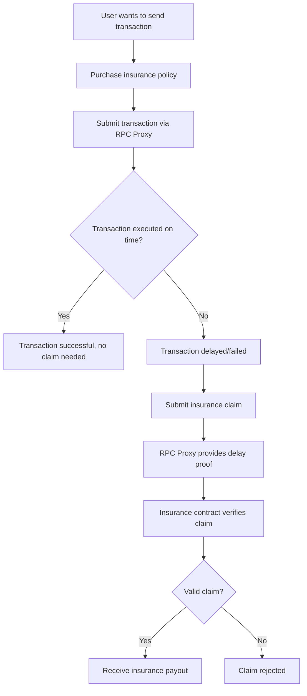

# Transaction Delay Insurance

## Demo and Video

The demo instructions and Video are [here](./demo/README.md).

## Abstract

This project provides a solution for mitigating the inconvenience and financial loss caused by transaction delays in Ethereum Virtual Machine (EVM) networks. It introduces a smart contract that acts as an insurance provider, allowing users to reclaim losses incurred due to delays without modifying their original transactions. The solution also uses an RPC proxy to record proof of transaction delays, enabling efficient claim processing.

## Introduction

EVM Transaction Delay can cause inconvenience and/or financial loss. One way to mitigate this problem
is to increase the Gas Priority Fee allowance when broadcasting the transaction. However, even this does not help with Zircuit, which has the ability to quarantine transactions upon suspicion of misbehavior as determined by their AI models.

This project aims to create a solution that provides insurance against transaction delays, allowing users to reclaim their losses in case of delayed transactions.

Modifying the original transaction can be a great inconvenience, especially if the code is not owned
by the sender.

## Solution

This solution involves creating a smart contract that acts as an insurance provider for transactions. The contract will allow users to purchase insurance for their transactions, which will cover losses incurred due to transaction delays.

In order to avoid modifying the original transaction, we provide a proxy RPC, which records the timestamps / block number when the transaction is broadcast and executed. This proxy signs the interaction, so it can be used as a proof of transaction delay when claiming the insurance payout.

We have considered direct interaction with the original RPC services and using TLS Notary in order to
obtain proofs of interaction and timestamps. While such alternative implementation would be completely trustless, it would introduce extra cost and transaction delays in order to create the ZK proofs,
which would defeat the goal of mitigating delays.

## Design

### System Architecture

The Transaction Delay Insurance system consists of three main components:
1. **Insurance Smart Contract** - Handles policy purchases, claims, and payouts
2. **RPC Proxy** - Records transaction timestamps and provides delay proofs
3. **User Interface** - Allows users to interact with the system

### Components

We implement the Web UI and the RPC Proxy.
The contracts are deployed on the Blockchain.

### Interaction Diagrams

#### 1. Insurance Policy Purchase Flow

#### 2. Transaction Broadcasting with Delay Tracking

#### 3. Insurance Claim Processing Flow

#### 4. Complete User Journey

### Component Interactions

#### RPC Proxy Responsibilities
- Record transaction submission timestamps
- Monitor transaction execution
- Generate cryptographic proofs of delays
- Provide signed attestations for claims

#### Insurance Contract Responsibilities
- Manage policy purchases and premiums
- Validate delay proofs from RPC Proxy
- Calculate and distribute payouts
- Maintain policy and claim records

#### Verification Process
- Timestamp validation against blockchain data
- Signature verification of RPC Proxy attestations
- Delay threshold validation based on policy terms
- Financial loss calculation and payout determination

## Implementation

### Front End

The front end is written in React. It connects to the
proxy RPC for all interactions. It provides the following user interfaces:
- Insurance quote and policy parameters,
- Insurance purchasing,
- Insurance claims,
- Claim status and history, and
- Sample call

### Contracts

The insurance contract manages the policies and their functionality. Initially
for this prototype there is only one policy for all.
This policy does the following:
- Provides read-only pricing, delay threshold and payout information,
- Provides a purchasing function, which records the number of incidents insured based on purchaser / caller 
address,
- Provides a claim / payout function, which checks the delay threshold and the number of incidents insured, and
processes the claim and payout. The claim itself consists of a transaction broadcast signed by the proxy,
and a signed transaction confirmation, which serve as
a proof in the claim. The signatures are checked using the EVM build-in ECDSA verification function and calculated payout is paid to the caller in native (ETH) currency.

The prototype policy works as follows:
- Each insurance purchase, pays 10%
of the fee to the protocol owner (deployer), and the rest to
the policy payout pool.
- Each insurance purchase pays a configured percentage (1%)
of the total funds in the pool. This depletes the policy payout pool.

### RPC Proxy

The RPC proxy is a middleware that intercepts the transaction broadcasts and records the timestamps
and block numbers of the transactions. It also signs the transaction broadcast and confirmation, which are used
as proofs in the insurance claim. The proxy is implemented as a Node.js application that uses the
`ethers.js` library to interact with the Ethereum network, in order to get the latest block number before each transaction is broadcast and record it in the response before signing it. It provides a REST API for the
front end to interact with.

## Future Work